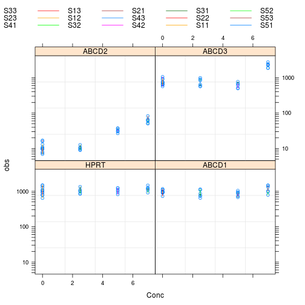
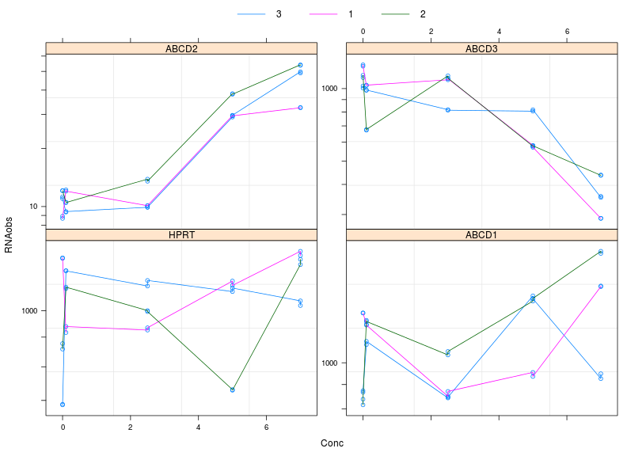
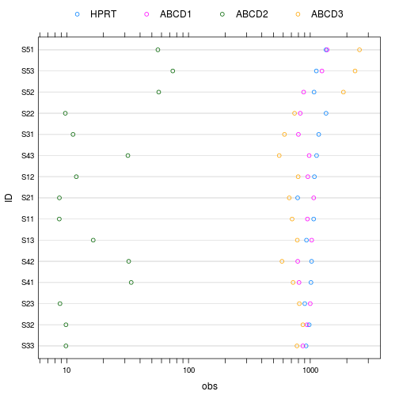
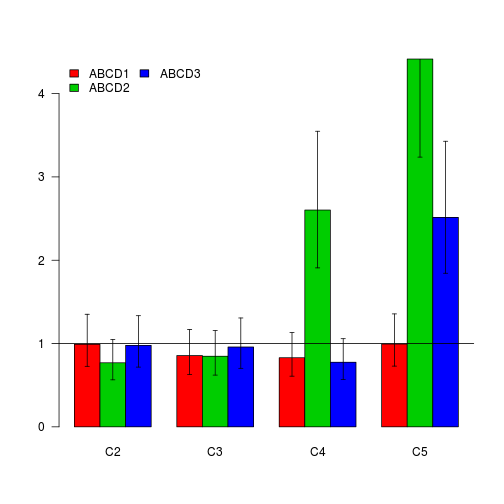

Design and Simulation of an gene expression experiment
======================================================

# Questions
- is gene expression different in differentiated cells?
- monocytes differentiates to macrophages
- drug concentrations induce gene expression?

# Design

## 5 cases
 case | differentiated  | drug concentration  
 ------------- | ------------- | -------------  
 1 | - | 0  
 2  | + | 0  
 3 | + | 2.5  
 4 | + | 5  
 5 | + | 7  

5 genes and duplicate measurement of each sample ID


```r
library(MASS)
library(nlme)
source("../src/myFun.R")
```

```
## Loading required package: survival
```

```
## Loading required package: splines
```

```
## Hmisc library by Frank E Harrell Jr
## 
## Type library(help='Hmisc'), ?Overview, or ?Hmisc.Overview') to see
## overall documentation.
## 
## NOTE:Hmisc no longer redefines [.factor to drop unused levels when
## subsetting.  To get the old behavior of Hmisc type
## dropUnusedLevels().
```

```
## Attaching package: 'Hmisc'
```

```
## Das folgende Objekt ist maskiert from 'package:survival':
## 
## untangle.specials
```

```
## Die folgenden Objekte sind maskiert from 'package:base':
## 
## format.pval, round.POSIXt, trunc.POSIXt, units
```

```
## Attaching package: 'plyr'
```

```
## Die folgenden Objekte sind maskiert from 'package:Hmisc':
## 
## is.discrete, summarize
```

```
## Loading required package: mvtnorm
```

```r
source("../src/helpers.R")
```


```r
mv <- c(HPRT = 1000, ABCD1 = 900, ABCD2 = 10, ABCD3 = 700)
conc <- c(0, 0, 2.5, 5, 7)
diff <- c(0, rep(1, length(conc) - 1))
hill <- 20
fold <- c(HPRT = 1.3, ABCD1 = 1.3, ABCD2 = 5, ABCD3 = 5)
ec50 <- c(HPRT = 10, ABCD1 = 7, ABCD2 = 5, ABCD3 = 7)
eps <- 0.2
Sigma <- diag(rep(0.1^2, length(mv)))
selGene <- c("HPRT", paste("ABCD", 1:3, sep = ""))
myF <- function(id, n) paste(id, n, sep = "")
yy <- function(x, ymin, fa, ec50) ymin * (1 + (fa - 1) * plogis(hill * 
    log(x/ec50)))
nRep <- 3
nId <- length(conc) * nRep
dd <- expand.grid(Case = seq(along = conc), Rep = 1:nRep, Obs = 1:2, Gene = selGene)
dd$FCase <- factor(myF("C", dd$Case), levels = myF("C", seq(along = conc)))
dd$ID <- paste("S", dd$Case, dd$Rep, sep = "")

dd <- transform(dd, ID = factor(ID, level = paste("S", rep(seq(along = conc), 
    each = nRep), rep(1:nRep, length(conc)), sep = "")), Conc = conc[Case], 
    mRNA = yy(conc[Case], mv[Gene], fold[Gene], ec50[Gene]))

rand <- with(dd, exp(mvrnorm(length(levels(ID)), rep(0, length(mv)), Sigma = Sigma)[ID]) * 
    mRNA)
dd$RNA <- rand
dd$obs <- exp(rnorm(nrow(dd), sd = eps)) * rand
head(dd)
```

```
##   Case Rep Obs Gene FCase  ID Conc mRNA    RNA    obs
## 1    1   1   1 HPRT    C1 S11  0.0 1000  963.4 1494.7
## 2    2   1   1 HPRT    C2 S21  0.0 1000  986.1  787.1
## 3    3   1   1 HPRT    C3 S31  2.5 1000 1098.6 1342.9
## 4    4   1   1 HPRT    C4 S41  5.0 1000  999.0  926.6
## 5    5   1   1 HPRT    C5 S51  7.0 1000 1170.0 1467.7
## 6    1   2   1 HPRT    C1 S12  0.0 1000 1044.1 1056.7
```


```r
gd <- groupedData(obs ~ Conc | ID, dd)
plot(gd, scale = list(y = xyLogscale()), aspect = "fill", outer = ~Gene)
```

 

```r
plot(gd, outer = ~Gene, aspect = "fill", scale = list(y = c(xyLogscale(c(1, 
    50000)), list(relation = "free"))))
```

 


```r
gd <- groupedData(obs ~ FCase | ID/Obs, dd)
plot(gd, displayLevel = 1, collapseLevel = 1, , scale = list(x = xyLogscale(c(1, 
    10000))), aspect = "fill", inner = ~Gene)
```

 


# lme


```r
fms1 <- lme(log10(obs) ~ Gene * FCase, gd, random = ~1 | ID)
anova(fms1)
```

```
##             numDF denDF F-value p-value
## (Intercept)     1    90   74377  <.0001
## Gene            3    90    3195  <.0001
## FCase           4    10      54  <.0001
## Gene:FCase     12    90      27  <.0001
```

```r
summary(fms1)$tT
```

```
##                       Value Std.Error DF   t-value   p-value
## (Intercept)        2.998008   0.03605 90  83.15233 6.696e-87
## GeneABCD1         -0.008551   0.04794 90  -0.17837 8.588e-01
## GeneABCD2         -1.923778   0.04794 90 -40.12781 3.185e-59
## GeneABCD3         -0.120439   0.04794 90  -2.51222 1.378e-02
## FCaseC2           -0.005489   0.05099 10  -0.10765 9.164e-01
## FCaseC3            0.008087   0.05099 10   0.15860 8.771e-01
## FCaseC4            0.020996   0.05099 10   0.41179 6.892e-01
## FCaseC5            0.070082   0.05099 10   1.37446 1.993e-01
## GeneABCD1:FCaseC2 -0.003939   0.06780 90  -0.05810 9.538e-01
## GeneABCD2:FCaseC2 -0.113812   0.06780 90  -1.67866 9.669e-02
## GeneABCD3:FCaseC2 -0.009543   0.06780 90  -0.14075 8.884e-01
## GeneABCD1:FCaseC3 -0.067509   0.06780 90  -0.99572 3.221e-01
## GeneABCD2:FCaseC3 -0.071932   0.06780 90  -1.06095 2.916e-01
## GeneABCD3:FCaseC3 -0.018420   0.06780 90  -0.27169 7.865e-01
## GeneABCD1:FCaseC4 -0.080965   0.06780 90  -1.19419 2.355e-01
## GeneABCD2:FCaseC4  0.415352   0.06780 90   6.12621 2.327e-08
## GeneABCD3:FCaseC4 -0.110251   0.06780 90  -1.62614 1.074e-01
## GeneABCD1:FCaseC5 -0.002605   0.06780 90  -0.03842 9.694e-01
## GeneABCD2:FCaseC5  0.644968   0.06780 90   9.51292 2.944e-15
## GeneABCD3:FCaseC5  0.400397   0.06780 90   5.90563 6.144e-08
```

```r
gdInt <- intervals(fms1, levels = 0.68)
```


# barplot


```r
int0 <- gdInt$fix
int <- int0[grep("^Gene", rownames(int0)), ]
int
```

```
##                     lower      est.    upper
## GeneABCD1         -0.1038 -0.008551  0.08669
## GeneABCD2         -2.0190 -1.923778 -1.82853
## GeneABCD3         -0.2157 -0.120439 -0.02520
## GeneABCD1:FCaseC2 -0.1386 -0.003939  0.13076
## GeneABCD2:FCaseC2 -0.2485 -0.113812  0.02088
## GeneABCD3:FCaseC2 -0.1442 -0.009543  0.12515
## GeneABCD1:FCaseC3 -0.2022 -0.067509  0.06719
## GeneABCD2:FCaseC3 -0.2066 -0.071932  0.06276
## GeneABCD3:FCaseC3 -0.1531 -0.018420  0.11627
## GeneABCD1:FCaseC4 -0.2157 -0.080965  0.05373
## GeneABCD2:FCaseC4  0.2807  0.415352  0.55005
## GeneABCD3:FCaseC4 -0.2449 -0.110251  0.02444
## GeneABCD1:FCaseC5 -0.1373 -0.002605  0.13209
## GeneABCD2:FCaseC5  0.5103  0.644968  0.77966
## GeneABCD3:FCaseC5  0.2657  0.400397  0.53509
```

```r
rownames(int) <- gsub("FCase", "", gsub("Gene", "", rownames(int)))
sel <- grep(":", rownames(int))
int <- int[sel, ]

tmp <- unPaste(rownames(int), sep = ":")
tmp
```

```
## [[1]]
##  [1] "ABCD1" "ABCD2" "ABCD3" "ABCD1" "ABCD2" "ABCD3" "ABCD1" "ABCD2"
##  [9] "ABCD3" "ABCD1" "ABCD2" "ABCD3"
## 
## [[2]]
##  [1] "C2" "C2" "C2" "C3" "C3" "C3" "C4" "C4" "C4" "C5" "C5" "C5"
```

```r
inta <- cbind(data.frame(int), Gene = tmp[[1]], FCase = tmp[[2]])
intal <- daply(inta, .(Gene), function(x) {
    y <- as.matrix(x[, 1:3])
    dimnames(y)[[1]] <- x$FCase
    y
})
# daply(inta,.(Gene),function(x) {y<-as.matrix(x[,1:3]);y})

intal
```

```
## , ,  = lower
## 
##        
## Gene         C2      C3      C4      C5
##   ABCD1 -0.1386 -0.2022 -0.2157 -0.1373
##   ABCD2 -0.2485 -0.2066  0.2807  0.5103
##   ABCD3 -0.1442 -0.1531 -0.2449  0.2657
## 
## , ,  = est.
## 
##        
## Gene           C2       C3       C4        C5
##   ABCD1 -0.003939 -0.06751 -0.08096 -0.002605
##   ABCD2 -0.113812 -0.07193  0.41535  0.644968
##   ABCD3 -0.009543 -0.01842 -0.11025  0.400397
## 
## , ,  = upper
## 
##        
## Gene         C2      C3      C4     C5
##   ABCD1 0.13076 0.06719 0.05373 0.1321
##   ABCD2 0.02088 0.06276 0.55005 0.7797
##   ABCD3 0.12515 0.11627 0.02444 0.5351
```

```r
# barPlotsInt(intal,T)
x <- intal
ym <- x[, , 2]
yup <- x[, , 3]
ylow <- x[, , 1]
LOG <- F
if (!LOG) {
    ym <- 10^ym
    yup <- 10^yup
    ylow <- 10^ylow
}
# LAS=2;lay=NULL;ylim=NULL;col=0 barx <-
# barplot(ym,beside=T,col=col,las=LAS,ylim=ylim,ylab=ylab,legend.text=T,args.legend
# = list(x = leg,ncol=2,bty = 'n'),layout=lay)

barx <- barplot(ym, beside = T, col = 2:4, las = 1, legend.text = T, args.legend = list(x = "topleft", 
    ncol = 2, bty = "n"))
abline(h = 1)
error.bar(barx, ym, yup - ym, ym - ylow)
```

 


