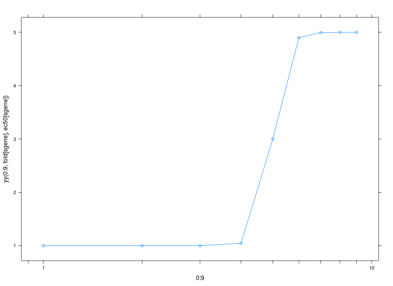
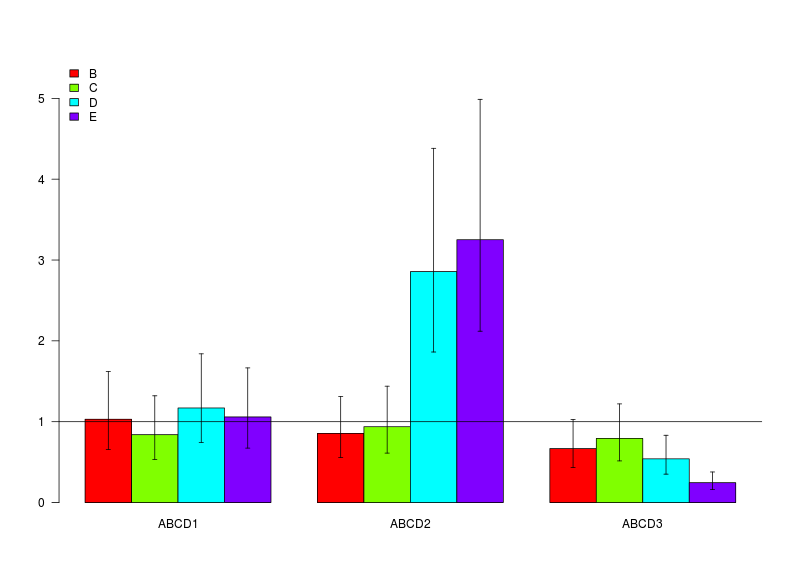

Design and Simulation of an gene expression experiment
======================================================

# Questions
- is gene expression different in differentiated cells?
- monocytes differentiates to macrophages
- drug concentrations induce gene expression?

# Design

## 5 cases
 case | differentiated  | drug concentration  
 ------------- | ------------- | -------------  
 1 | - | 0  
 2  | + | 0  
 3 | + | 2.5  
 4 | + | 5  
 5 | + | 7  


\[R=R_{min}+(R_{max}-R_{min})*P_{logis} \]
\[R_{max}=F_{fold}\times R_{min}\]
\[R=R_{min}(1+(F_{fold}-1))*P_{logis}(hill*log(conc/EC_{50})) \]

## Seed
R generates pseudo rondom numbers. You can get identical sets of random numbers with set.seed(1234). With varying seed you will get different results for each simulaton step.

## Confidence intervals
Confidence intervals should include the start parameter set!


```r
project <- "design"
setwd(paste("~/Arbeitsfläche/simStudy", project, sep = "/"))
```


5 genes and duplicate measurement of each sample ID


```r
library("ProjectTemplate")
load.project()
opts_chunk$set(cache = FALSE, dev = c("png", "pdf"), echo = FALSE, message = FALSE, 
    fig.width = 11, fig.height = 8, warning = FALSE, results = "hide")
library(MASS)
library(nlme)
source("src/myFun.R")
source("src/helpers.R")
```


# Conc response function

- between sample variability \( \omega \) = 0.2
- within sample or residual variability \( \sigma \) = 0.1

parameter | HPRT | ABCD1 | ABCD2 | ABCD3
 -------- | ----- |----- | ----- | -----
$R_{min}$ | 1000  | 1000 | 10 | 1000
$F_{fold}$ | 1  | 1 | 5 | .7
$EC_{50}$ | 1  | 1 | 5 | 5


 


```
##   Case Rep Obs  ID Conc FCase Gene    RNA RNAobs
## 1    1   1   1 S11    0     A HPRT 1218.2 1233.3
## 2    1   1   2 S11    0     A HPRT 1218.2 1230.5
## 3    1   2   1 S12    0     A HPRT  881.7  877.3
## 4    1   2   2 S12    0     A HPRT  881.7  858.3
## 5    1   3   1 S13    0     A HPRT  700.4  689.4
## 6    1   3   2 S13    0     A HPRT  700.4  687.8
```


  


 


# lme


```
##                      lower      est.     upper
## (Intercept)      7.281e+02 902.92008 1.120e+03
## GeneABCD1        7.809e-01   1.07563 1.482e+00
## GeneABCD2        8.652e-03   0.01171 1.585e-02
## GeneABCD3        9.184e-01   1.24597 1.690e+00
## FCaseB           8.341e-01   1.17343 1.651e+00
## FCaseC           7.962e-01   1.12015 1.576e+00
## FCaseD           7.555e-01   1.06280 1.495e+00
## FCaseE           9.145e-01   1.28659 1.810e+00
## GeneABCD1:FCaseB 6.553e-01   1.03063 1.621e+00
## GeneABCD2:FCaseB 5.576e-01   0.85538 1.312e+00
## GeneABCD3:FCaseB 4.339e-01   0.66792 1.028e+00
## GeneABCD1:FCaseC 5.337e-01   0.83939 1.320e+00
## GeneABCD2:FCaseC 6.116e-01   0.93827 1.439e+00
## GeneABCD3:FCaseC 5.149e-01   0.79264 1.220e+00
## GeneABCD1:FCaseD 7.437e-01   1.16966 1.840e+00
## GeneABCD2:FCaseD 1.862e+00   2.85662 4.382e+00
## GeneABCD3:FCaseD 3.512e-01   0.54058 8.321e-01
## GeneABCD1:FCaseE 6.732e-01   1.05884 1.665e+00
## GeneABCD2:FCaseE 2.119e+00   3.25133 4.988e+00
## GeneABCD3:FCaseE 1.595e-01   0.24559 3.780e-01
## attr(,"label")
## [1] "Fixed effects:"
```

```
##  HPRT ABCD1 ABCD2 ABCD3 
##  1000  1000    10  1000
```

```
## $ID
##                 lower    est.  upper
## sd(GeneHPRT)  0.05250 0.08143 0.1263
## sd(GeneABCD1) 0.05786 0.08973 0.1392
## sd(GeneABCD2) 0.05189 0.08049 0.1248
## sd(GeneABCD3) 0.05273 0.08178 0.1268
## 
## attr(,"label")
## [1] "Random Effects:"
```

```
##    lower     est.    upper 
## 0.003613 0.004321 0.005167 
## attr(,"label")
## [1] "Within-group standard error:"
```

```
## omega   eps 
##   0.2   0.1
```


# barplot


 


 


# Results

- no influence of cell differentiation is assumed
- lme results represents input parameter
- experimental design sufficient to show strong induction of gene expression
- repeating simulations with different assumption may result in the sensitivity of the design.


